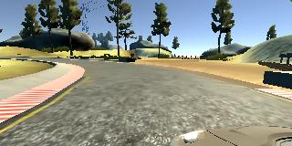

# **Behavioral Cloning**

## Writeup Template

---

**Behavioral Cloning Project**

The goals / steps of this project are the following:
* Use the simulator to collect data of good driving behavior
* Build, a convolution neural network in Keras that predicts steering angles from images
* Train and validate the model with a training and validation set
* Test that the model successfully drives around track one without leaving the road
* Summarize the results with a written report

## Rubric Points
### Here I will consider the [rubric points](https://review.udacity.com/#!/rubrics/432/view) individually and describe how I addressed each point in my implementation.  

---
### Files Submitted & Code Quality

#### 1. Submission includes all required files and can be used to run the simulator in autonomous mode

My project includes the following files:
* model.py containing the script to create and train the model
* drive.py for driving the car in autonomous mode
* model.h5 containing a trained convolution neural network
* writeup_report.md or writeup_report.pdf summarizing the results

#### 2. Submission includes functional code
Using the Udacity provided simulator and my drive.py file, the car can be driven autonomously around the track by executing
```sh
python drive.py model.h5
```

#### 3. Submission code is usable and readable

The model.py file contains the code for training and saving the convolution neural network. The file shows the pipeline I used for training and validating the model, and it contains comments to explain how the code works.

### Model Architecture and Training Strategy

#### 1. An appropriate model architecture has been employed

My model consists of a convolutional neural network:

Layers 1-3: convolution, 5x5 filter, stride of 2, 24 to 48 depth, relu
Layers 4-5: convolution, 3x3 filter, stride of 1, 64 depth, relu
Layers 6-9: fully connected, width 100 down to 1, no activation

The RELU layers introduce nonlinearity. Dropout is implemented after the first fully connected layer to prevent overfitting. Data preparation includes converting to grayscale, cropping and data normalization using a Keras lambda layer.

#### 2. Attempts to reduce overfitting in the model

The model contains one dropout layer with 20% dropout in order to reduce overfitting (model.py line 113).

The model was trained and validated on different data sets to ensure that the model was not overfitting (code lines 12-45).

The model was tested by running it through the simulator and ensuring that the vehicle could stay on the track.

#### 3. Model parameter tuning

The model used an adam optimizer, so the learning rate was not tuned manually (model.py line 119).

#### 4. Appropriate training data

Training data was chosen to keep the vehicle driving on the road. In addition to normal, center-track driving, data included swerving left to right, driving in the opposite direction (clockwise) and using left and right camera images in difficult sections of the track.

For details about how I created the training data, see the next section.

### Model Architecture and Training Strategy

#### 1. Solution Design Approach

The overall strategy for deriving a model architecture was to start with a simple model and then enhance it until I achieved good results.

My first model had 3 convolutional layers, two using a 5x5 filter and depths of 16 and 32, and then using a 3x3 filter with a depth of 64. Those layers were followed by fully connected layers with width 128, 64 and 1.

In order to gauge how well the model was working, I split my image and steering angle data into a training and validation set. I found that my first model had a low mean squared error on the training set but a high mean squared error on the validation set. This implied that the model was overfitting.

I also experimented with adding reverse-direction data and additional data around curves, but none of these enabled the model to successfully navigate the dirt-lined curve after the bridge.

Therefore, I enhance the model using the NVIDIA architecture and to combat the overfitting I added dropout of 20% (keep probability of 80%).

This improved the car's performance on the dirt-lined curve, but the car either hit the barrier at the end of the curve or drove up onto the ledges after the curve.

The final improvement in driving performance came from adding specific data around the problem curves and including left and right camera angle images for those curves.

At the end of the process, the vehicle is able to drive autonomously around the track without leaving the road.

#### 2. Final Model Architecture

The final model architecture (model.py lines 102-116) consisted of a convolution neural network with the following layers and layer sizes:

Cropping: from 160x320 Tto 65x320
Normalization using a Lambda layer
Layers 1-3: convolutional, 5x5 filter, stride of 2, 24 to 48 depth, relu
Layers 4-5: convolutional, 3x3 filter, stride of 1, 64 depth, relu
Layers 6-9: fully connected, width 100 down to 1, no activation

Code:

model = Sequential()
model.add(Cropping2D(cropping=((70, 25), (0, 0)), input_shape=(160, 320, 3)))
model.add(Lambda(lambda x: x / 255 - 0.5))
model.add(Convolution2D(24, 5, 5, subsample=(2, 2), activation='relu'))
model.add(Convolution2D(36, 5, 5, subsample=(2, 2), activation='relu'))
model.add(Convolution2D(48, 5, 5, subsample=(2, 2), activation='relu'))
model.add(Convolution2D(64, 3, 3, activation='relu'))
model.add(Convolution2D(64, 3, 3, activation='relu'))
model.add(Flatten())
model.add(Dense(100))
model.add(Dropout(0.2))
model.add(Dense(50))
model.add(Dense(10))
model.add(Dense(1))

#### 3. Creation of the Training Set & Training Process

All of my data came from Track 1.

To capture good driving behavior, I first recorded two laps using center lane driving. Here is an example image of center lane driving:


Then I repeated this process driving in the opposite direction (clockwise) on track one in order to get more data points and to help prevent overfitting.

I then recorded the vehicle recovering from the left and right sides of the road back to center so that the vehicle would learn to recover after drifting to the track edges:


To augment the data sat, I also collected data around specific problem areas of the track and included left and right camera angle images:




After the collection process, I had 14,301 + 8,362 + 9,375 + 2,664 + 2,049 = 36,751 number of data points. I then preprocessed this data by converting to grayscale, normalizing and cropping to eliminate data from the hood of the car and the landscape on the horizon.

I used this training data for training the model. I noticed the accuracy increase from the 3rd epoch and so I set the number of epochs to 2. I used an adam optimizer so that manually training the learning rate wasn't necessary.
